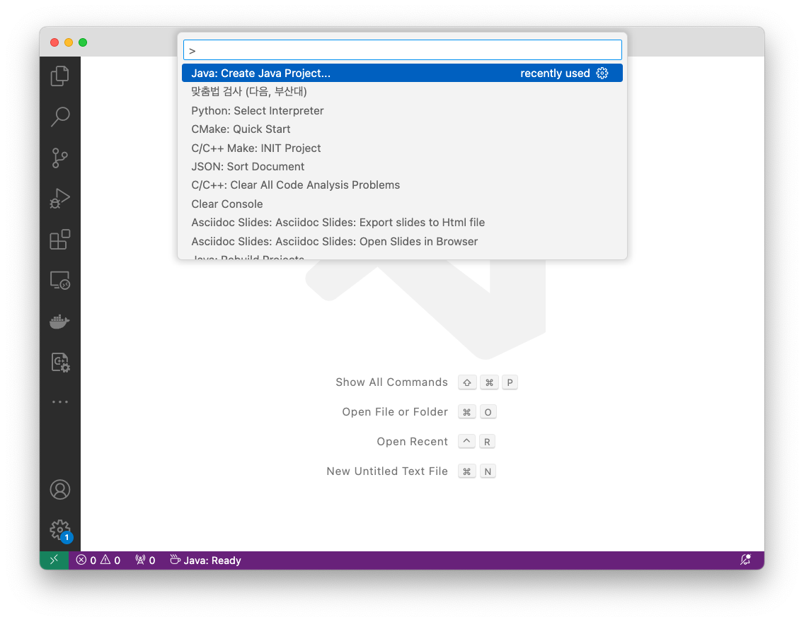
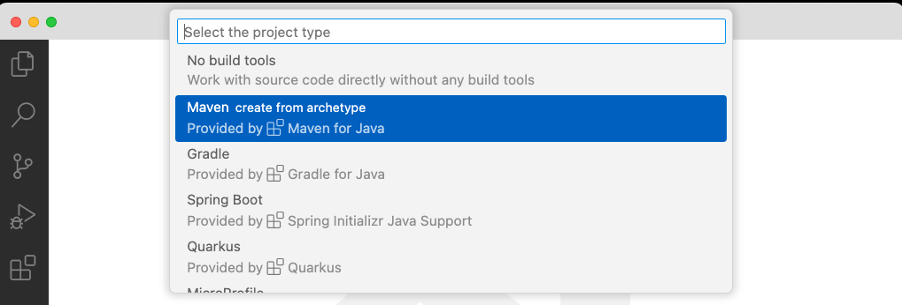
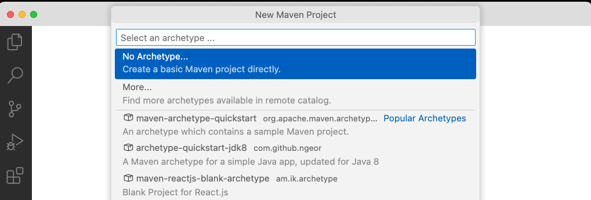
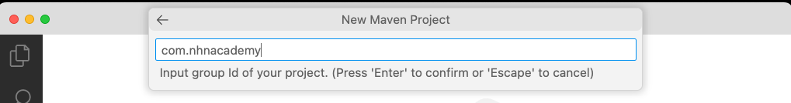
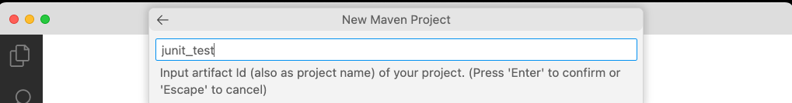
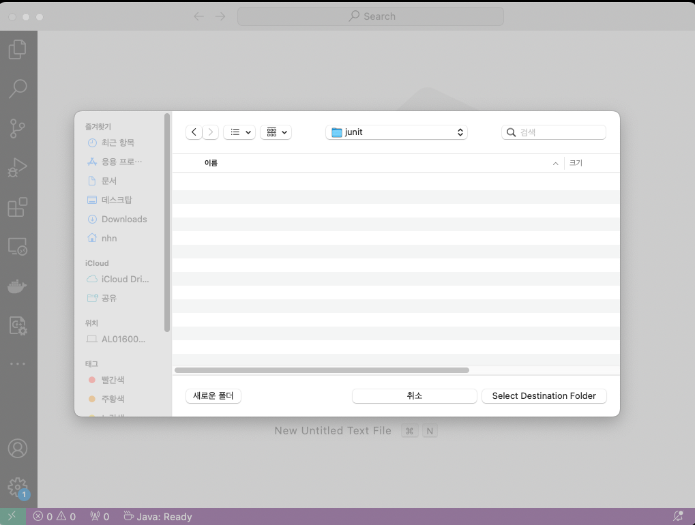
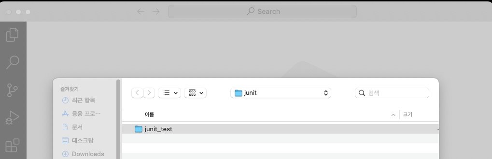
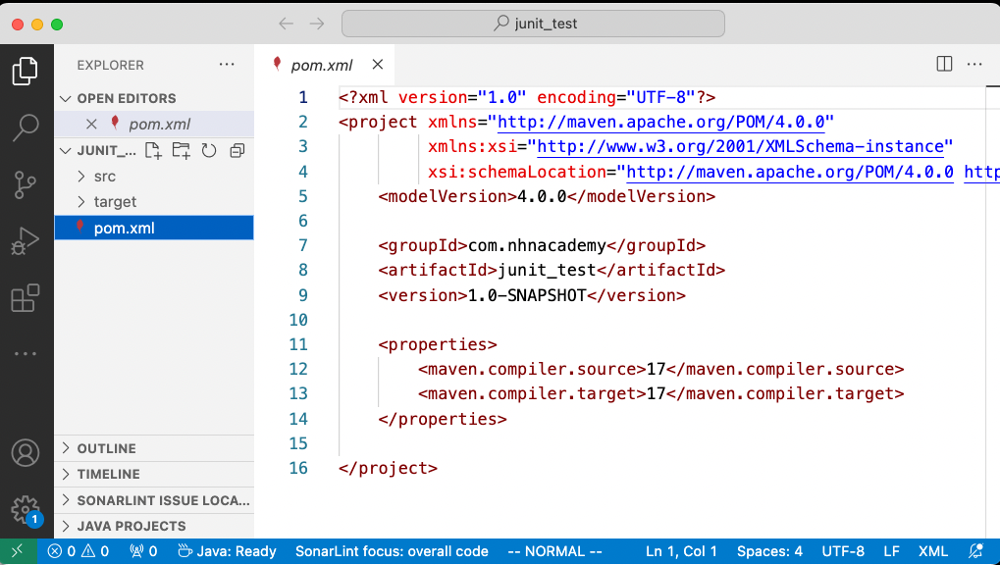

= VSCode에서 빌드 툴로 maven을 사용하도록 프로젝트 생성하고, 종속성 추가에 대해 확인해 보자.

. F1 -> Java: Create Java Project...
+

. maven create from achetype
+

. No Archetype
+

. New Maven Project에서 com.nhnacademy 입력
+

. input artifact id
+

. 프로젝트 폴더 선택
+

. 프로젝트 생성 확인 후 열기
+

. 생성된 프로젝트에서 pom.xml 파일 열기
+

---

[cols="1,1,1", frame=none, grid=none]
|===
<s|
link:./junit5_guide.adoc[이전]
^s|
ifndef::env-github[]
link:../index.adoc[목록]
endif::[]

ifdef::env-github[]
link:../README.md[목록]
endif::[]
>s|
|===