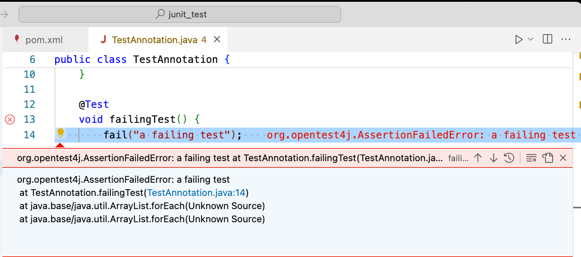
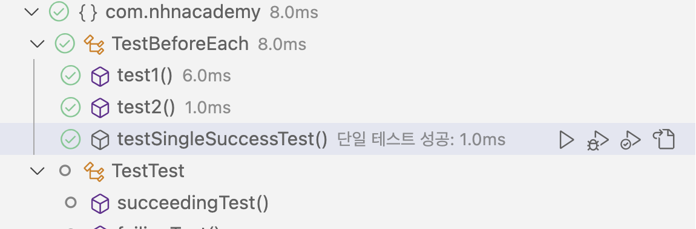

= JUnit 5 Guide

== 1. 개요

* Java에서 가장 인기 있는 Unit Testing Framework 중 하나
* Java 8 이상의 새로운 기능 지원
* 다양한 테스트 스타일을 가능하게 하는 여러 혁신적인 기능 포함
* IntelliJ IDEA , Eclipse , NetBeans 및 Visual Studio Code 등의 인기 있는 IDE에서 지원
* Gradle, Maven, Ant 등 다양한 빌드 툴 지원

== 2. Maven Dependencies

* pom.xml에 종속성 추가
+
[source,xml]
----
<dependency>
    <groupId>org.junit.jupiter</groupId>
    <artifactId>junit-jupiter-engine</artifactId>
    <version>5.9.2</version>
    <scope>test</scope>
</dependency>
----
* Eclipse, IntelliJ 및 VSCode 등에서 단위 테스트를 직접 실행하도록 지원
* Maven Test goal을 사용하여 테스트

* link:./example01.adoc[예제 1. VSCode에서 빌드 툴로 maven을 사용하도록 프로젝트 생성하고, 종속성 추가에 대해 확인해 보자.]

== 3. Architecture

* JUnit 5는 세 개의 하위 프로젝트에서 여러 다른 모듈로 구성
** JUnit Platform
** JUnit Jupiter
*** JUnit 5에서 테스트와 확장 기능을 작성하기 위한 프로그래밍 모델과 확장 모델을 결합한 것
*** TestEngine플랫폼에서 Jupiter 기반 테스트를 실행하기 위한 기능 제공
** JUnit Vintage
*** JUnit 3 및 JUnit 4 기반 테스트를 실행하기 위한 TestEngine 제공
*** 클래스 경로 또는 모듈 경로에 JUnit 4.12 이상이 있어야 함

=== 3.1. JUnit Platform

**주요 기능**

* Test Engine API
** 다양한 테스트 프레임워크와 통합할 수 있는 테스트 엔진 API 제공
** JUnit Jupiter(즉, JUnit 5)와 JUnit Vintage(즉, JUnit 3 및 JUnit 4)는 이 API를 통해 실행
** 또한, 다른 테스트 프레임워크도 이 API를 구현하여 JUnit Platform을 통해 실행 가능
* Launcher API
** 테스트를 실행하고 결과를 수집하기 위한 런처 API 제공
** IDE, 빌드 도구, 또는 다른 테스트 런처에서 사용될 수 있음
* Command Line Interface(CLI):
** CLI를 제공하여 사용자가 터미널에서 직접 시험실행 가능
** CI/CD 환경에서 유용
* JUnit Console Launcher
** 콘솔 기반의 시험실행 도구
** 명령줄에서 테스트를 실행하고 보고서를 생성
* TestEngine 발견 및 등록
** 클래스 패스에서 자동으로 TestEngine 구현을 발견하고 등록
** 이를 통해 개발자는 다양한 테스트 엔진을 쉽게 통합하여 사용 가능
* 조건부 시험실행
** 특정 조건에 따라 테스트를 실행하거나 건너뛸 수 있는 기능 제공
** 예를 들어, 환경 변수나 시스템 속성에 따라 테스트를 실행할지 여부 결정
* Tagging 및 필터링
** 테스트에 태그를 붙이고, 태그에 따라 테스트를 필터링하여 실행
** 특정 테스트 세트를 선택적으로 실행하는 데 유용함
* 확장 가능성
** 확장할 수 있는 구조로 되어 있어, 다양한 개별화와 플러그인 작성 용이
** 예를 들어, 주문형 테스트 엔진이나 리포터 작성 가능
* 다양한 통합 도구와의 호환성을 고려하여 설계
** JUnit 5가 이전 버전인 JUnit 4와 호환되면서도 새로운 기능을 제공하는 데 중요 역할

== 4. Annotations

* 많이 사용되는 몇 가지 annotation에 관해서만 설명

[cols="1a,7a"]
|===
^s|주석 ^s|설명
s|@Test
|* 테스트 메서드임을 표시

s|@ParameterizedTest
|* 매개 변수화된 테스트임을 표시

s|@RepeatedTest
|* 메서드가 반복 테스트를 위한 test template임을 표시

s|@TestFactory
|* 메서드가 동적 테스트를 위한 test factory임을 표시

s|@TestClassOrder
|* annotation이 달린 테스트 클래스의 @Nested 테스트 클래스에 대한 테스트 클래스 실행 순서를 구성하는 데 사용

s|@TestMethodOrder
|* annotation이 달린 테스트 클래스에 대한 테스트 메서드 실행 순서를 구성하는 데 사용
* JUnit 4의 @FixMethodOrder와 유사

s|@DisplayName
|* 테스트 클래스 또는 테스트 메서드에 대한 사용자 정의 표시 이름 선언

s|@BeforeEach
|* annotation이 달린 메서드는 현재 클래스의 각 @Test, @RepeatedTest, @ParameterizedTest 또는 @TestFactory 메서드 전에 실행되어야 함을 나타냄
* JUnit 4의 @Before와 유사

s|@AfterEach
|* annotation이 달린 메서드는 현재 클래스의 각 @Test, @RepeatedTest, @ParameterizedTest 또는 @TestFactory 메서드 후에 실행되어야 함을 나타냄
* JUnit 4의 @After와 유사

s|@BeforeAll
|* annotation이 달린 메서드는 현재 클래스의 모든 @Test, @RepeatedTest, @ParameterizedTest 및 @TestFactory 메서드 전에 실행되어야 함을 나타냄
* . JUnit 4의 @BeforeClass와 유사

s|@AfterAll
|* annotation이 달린 메서드는 현재 클래스의 모든 @Test, @RepeatedTest, @ParameterizedTest 및 @TestFactory 메서드 후에 실행되어야 함을 나타냄
* JUnit 4의 @AfterClass와 유사

s|@Disabled
|* 테스트 클래스나 테스트 메서드를 비활성화
* JUnit 4의 @Ignore와 유사

s|@Timeout
|* Test, TestFactory, TestTemplate 또는 수명 주기 메서드의 실행이 주어진 기간을 초과하면 실패

|===

=== 4.1. Test Annotation

==== 4.1.1. @Test

* 기본 테스트 케이스
* 테스트 코드가 아무런 문제 없이 수행될 경우, 성공
* 함수 외부로 던져지는 exception 발생 시, 실패
** 테스트 코드가 특정 exception 발생을 목적으로 한다면, 별도 처리 필
+
[source,java]
----
@Test
void succeedingTest() {
}

@Test
void failingTest() {
    fail("a failing test");
}
----
+

* fail()은 테스트가 실패한 것을 알리기 위해 호출하며, AssertionFailedError exception 발생
+

==== 4.1.2. @RepeatedTest

* 지정된 횟수만큼 반복하여 테스트
* 각 호출은 동일한 생명주기 콜백과 확장 기능을 완벽하게 지원하는 일반 @Test 메서드의 실행처럼 동작
+
[source,java]
----
@RepeatedTest(10)
void repeatedTest() {
    // ...
}
----
** 10회 반복 실행
* 속성 설정을 통해 반복 횟수 및 종료 조건 등 변경 가능
** 별도의 속성 지정이 없을 경우, 반복 횟수로 설정
** value - 반복 횟수
** failureThreshold - 실패 허용 횟수
** name - 로그 출력 패턴 변경
*** 기본 표시 - repetition {currentRepetition} of {totalRepetitions}
*** name = "{displayName} {currentRepetition}/{totalRepetitions}" 지정으로 변경 가능
* RepetitionInfo를 이용해 현재 동작 상태 정보 확인 가능
**
** @RepeatedTest, @BeforeEach, 또는 @AfterEach에서 확인 가능
* link:example02.adoc[예제 2. 다음의 @RepeatedTest를 동작시켜 각각의 설정에 관해 확인해 보자.]

==== 4.1.3. @ParameterizedTest

* 다양한 인수로 테스트 여러 번 실행
* 각 호출에 대한 인수를 제공할 최소한의 소스 선언
* 테스트 메서드에서 해당 인수 사용
* 파라미터의 소스는 대부분의 타입 사용이 가능
** value
** method
** field
** enum
** csv, csv 파일
** 사용자 정의 등
* link:./example03.adoc[예제 3. ParameterizedTest를 이용해 5개의 정수를 하나씩 적용하여 테스트해 보자.]

=== 4.2. Test Instance Lifecycle

* 테스트 인스턴스 상태 변화로 인한 부작용 방지를 위해 테스트마다 새로운 테스트 인스턴스 생성
* 인스턴스 생성에 맞춰 초기화나 마무리 가능

==== 4.2.1. @BeforeAll

* 클래스의 모든 테스트 메서드 실행 전에 한 번만 실행
* 클래스 머세드로 정의되어야 하므로 static
+
[source,java]
----
@BeforeAll
static void setup() {
    log.info("@BeforeAll - 이 클래스의 모든 테스트 메서드 실행 전에 한 번 실행됩니다.");
}
----

==== 4.2.2. @BeforeEach

* 클래스의 각 테스트 메서드 실행 전에 실행
+
[source,java]
----
@BeforeEach
void init() {
    log.info("@BeforeEach - 이 클래스의 각 테스트 메서드 실행 전에 실행됩니다.");
}
----

==== 4.2.3. @AfterEach

* 클래스의 각 테스트 메서드 실행 후에 실행
+
[source,java]
----
@AfterEach
void tearDown() {
    log.info("@AfterEach - 각 테스트 메서드 실행 후에 실행됩니다.");
}
----

==== 4.2.4. @AfterAll

* BeforeAll과 마찬가지로 클래스의 모든 테스트 메서드 실행 후에 실행
* 클래스 머세드로 정의되어야 하므로 static
+
[source,java]
----
@AfterAll
static void done() {
    log.info("@AfterAll - 모든 테스트 메서드 실행 후에 실행됩니다.");
}
----

=== 4.3. Optional Annotation

* 부가정보나 동작 제어를 위해 추가 가능

==== 4.3.1. @DisplayName

* 테스트 메서드에 대한 사용자 정의 표시 이름
* 일부 IDE에서 제대로 동작하지 않는 경우가 있으며, 대부분 구글링으로 해결 가능
+
[source,java]
----
@DisplayName("단일 테스트 성공")
@Test
void testSingleSuccessTest() {
    log.info("성공");
}
----
* VSCode에서 설정 결과는
+

==== 4.3.2. @Disabled

* 작성 중이거나 테스트에서 제외할 필요가 있는 경우, 해당 테스트 메서드를 비활성화시킴
+
[source,java]
----
@Test
@Disabled("아직 구현되지 않음")
void testShowSomething() {
}
----

== 5. Decision and Control

* 수행 결과를 판정
** 수행 결과가 의도한 결과와 일치하는지 확인
* 테스트 조건을 만족하는지 확인
** 테스트 조건이 만족하지 않을 경우, 해당 테스트를 건너뛸 수 있음.
* JUnit 5는 특히 람다 표현식을 포함하여 Java 8의 새로운 기능을 최대한 활용

=== 5.1. Assertions

* 테스트 코드가 만족하는 조건 설정
* 테스트 코드 실행 후 결과가 조건과 맞지 않을 경우, exception 발생
* org.junit.jupiter.api.Assertions
* assertTrue
+
[source,java]
----
@Test
void lambdaExpressions() {
    List numbers = Arrays.asList(1, 2, 3);
    assertTrue(numbers.stream()
      .mapToInt(Integer::intValue)
      .sum() > 5, () -> "합계가 5보다 커야 합니다.");
}
----
* assertAll
** assertion을 그룹화
** 그룹 내에서 실패한 assertion을 MultipleFailuresError로 보고
+
[source,java]
----
@Test
void groupAssertions() {
    int[] numbers = {0, 1, 2, 3, 4};
    assertAll("numbers",
        () -> assertEquals(numbers[0], 1),
        () -> assertEquals(numbers[3], 3),
        () -> assertEquals(numbers[4], 1)
    );
}
----

=== 5.2. fail

* assertTrue, assertFalse 등의 assertion을 이용하지 않고, 테스트 결과 실패를 반환하는 경우
+
[source,java]
----
@Test
void testFail() {
    fail("failed");
}
----

=== 5.3. Assumptions

* 테스트 코드가 실행되기 위한 조건을 설정
** 조건을 만족하는 경우, 테스트 코드 실행
** 조건을 충족시키지 못하는 경우, TestAbortedException이 발생하고 테스트는 단순히 건너뜀
* 테스트가 제대로 실행되기 위해 필요한 외부 조건에 일반적으로 사용
* 테스트되는 것과 직접적인 관련 없음

==== 5.3.1. assumeTrue

* 조건이 true로 만족할 경우에만 assertEquals() 실행
+
[source,java]
----
@Test
void trueAssumption() {
    assumeTrue(5 > 1);
    assertEquals(5 + 2, 7);
}
----

==== 5.3.2. assumeFalse

* 조건이 false로 만족할 경우에만 assertEquals() 실행
+
[source,java]
----
@Test
void falseAssumption() {
    assumeFalse(5 < 1);
    assertEquals(5 + 2, 7);
}
----

==== 5.3.2. assumeThat

* assumeTrue와 assumeFalse와 달리 조건과 실행문을 인수로 받음
* 조건이 만족하는 경우에만 실행문 실행
+
[source,java]
----
@Test
void assumptionThat() {
    String someString = "Just a string";
    assumingThat(
        someString.equals("Just a string"),
        () -> assertEquals(2 + 2, 4)
    );
}
----

== 6. Exception Testing

* 테스트 코드에서 exception 발생 여부로 테스트 결과 판정

=== 6.1. assertThrows

* 테스트 코드가 정상적으로 수행될 경우, 요구되는 exception이 반드시 발생
+
[source,java]
----
@Test
void assertThrowsException() {
    String str = null;
    assertThrows(IllegalArgumentException.class, () -> {
      Integer.valueOf(str);
    });
}
----
* 발생된 exception의 확인이 필요한 경우,
+
[source,java]
----
@Test
void shouldThrowException() {
    Throwable exception = assertThrows(UnsupportedOperationException.class, () -> {
      throw new UnsupportedOperationException("지원되지 않음");
    });
    assertEquals("지원되지 않음", exception.getMessage());
}

----

== 7. Dynamic Tests

* 런타임에 생성된 테스트 케이스를 선언하고 실행
* 컴파일 타임에 고정된 수의 테스트 케이스를 정의하는 정적 테스트와 달리, 동적 테스트는 런타임에 테스트 케이스를 동적으로 정의

=== 7.1. @TestFactory

* 목적
** 동적으로 테스트 케이스를 생성하기 위해 사용
** 즉, 테스트 메서드가 실행될 때 여러 개의 테스트를 생성하여 반환
* 반환 타입
** Stream<DynamicTest>, Collection<DynamicTest>, Iterable<DynamicTest>, 또는 Iterator<DynamicTest> 등의 타입 반환
* 동적 테스트
** 테스트가 실행될 때마다 테스트 케이스를 동적으로 생성
** 테스트 케이스가 고정되어 있지 않고, 실행 시점에 생성
*** Java 8의 lambda 사용

[source,java]
----
import org.junit.jupiter.api.DynamicTest;
import org.junit.jupiter.api.TestFactory;

import java.util.stream.Stream;

import static org.junit.jupiter.api.DynamicTest.dynamicTest;

public class DynamicTestExample {

    @TestFactory
    Stream<DynamicTest> dynamicTests() {
        return Stream.of("A", "B", "C")
                .map(str -> dynamicTest("test" + str, () -> {
                    // 테스트 로직
                    System.out.println("Testing " + str);
                }));
    }
}
----

=== 7.2. TestFactory와 ParameterizedTest의 차이

**공통점**

* 동적으로 데이터 제공 가능
** @MethodSource는 메서드에서 데이터를 가져오고, @TestFactory는 실행 시점에 동적으로 테스트 생성

**차이점**

* @ParameterizedTest + @MethodSource
** 테스트 메서드 반복 호출
** 각 호출 시 다른 파라미터 주입
** 하나의 테스트 메서드에 파라미터가 주어지는 방식
** void 반환
** 결과는 단일 테스트 메서드가 여러 번 호출된 것으로 보고
** 각 파라미터에 대한 테스트 결과가 동일한 메서드에 대해 반복적으로 기록
* @TestFactory
** 여러 개의 개별 테스트 인스턴스 생성
** 각 테스트 인스턴스는 독립적으로 실행
** DynamicTest 객체들의 collection이나 stream 반환
** 각 DynamicTest는 독립적인 테스트
** 각 DynamicTest는 개별 테스트 보고
** 독립적인 테스트 케이스로 취급되어, 개별적으로 결과 기록

== 8. 참고

* link:https://junit.org/junit5/docs/current/user-guide/[JUnit 5 User Guide]
* Baeldung
** link:https://www.baeldung.com/junit-5[A Guide to JUnit 5]
** link:https://www.baeldung.com/parameterized-tests-junit-5[Guide to JUnit 5 Parameterized Tests]
** link:https://www.baeldung.com/junit-5-test-annotation[JUnit 5 @Test Annotation]
** link:https://www.baeldung.com/junit-5-extensions[A Guide to JUnit 5 Extensions]

---

---

ifndef::env-github[]
link:../index.adoc[목록]
endif::[]

ifdef::env-github[]
link:../README.md[목록]
endif::[]
